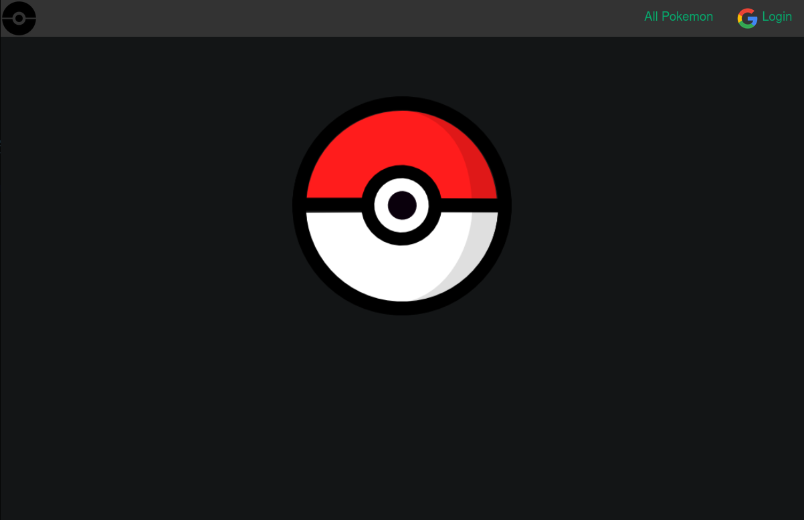
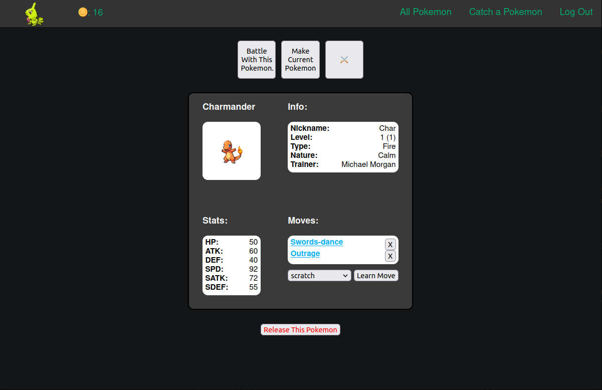
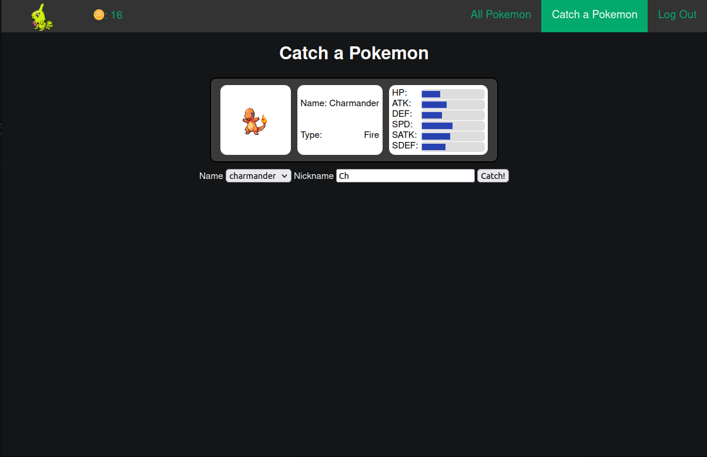
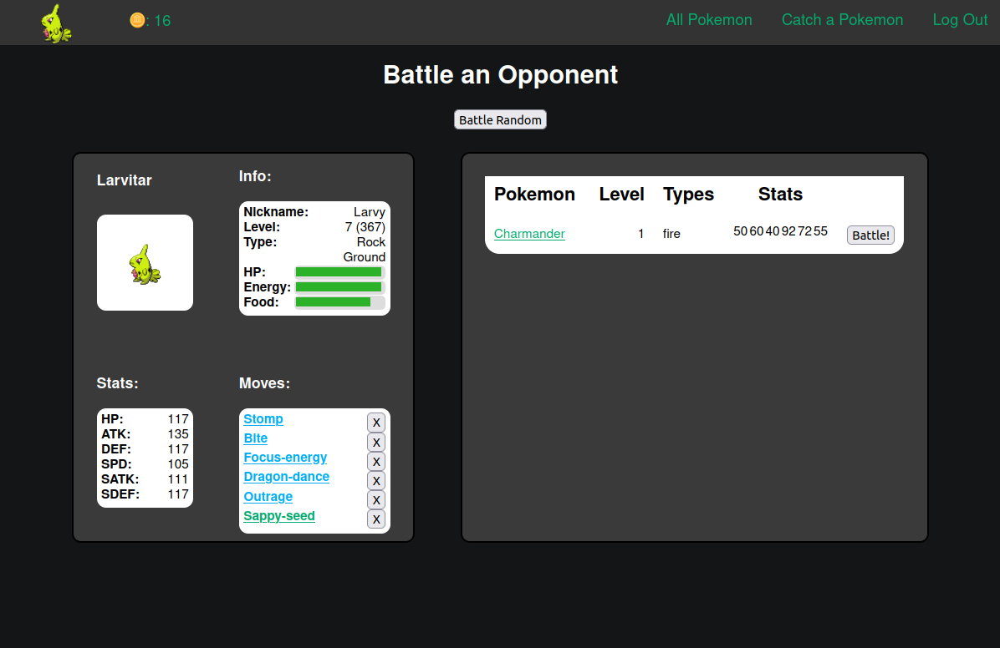
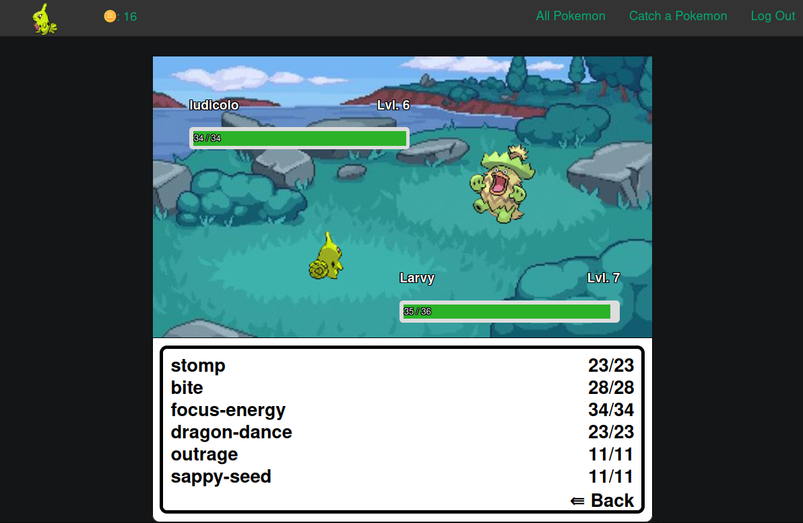
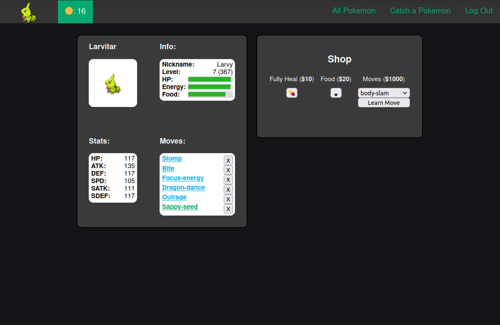

# Pokemon CRUD Application

This web application uses CRUD to create an online platform for catching, training, and battling pokemon.

### Main Functionality

The application is set up in a way to connect users to pokemon which are connected to moves.

On the homepage, users have limited options unless they have logged in, which they can access via the top right of the screen. While not logged in users have access to an index list of all caught pokemon.

From the index, user can see basic information of each pokemon, including their name, images, level, and trainer. The table can be sorted by clicking on the headers and can be used to look at each individual pokemon in greater detail.

### Logged on Functionality

The show page gives more information about a pokemon's stat, and if the pokemon is owned by you, shows options for battling other pokemon, and making the pokemon your current, main pokemon, which allows access to the shop and renders another option for battling the currently viewed pokemon with your current pokemon. Additionally, if the pokemon is high enough level, it can learn moves (which can be deleted for free) and even evolve!

Before making a pokemon your current pokemon, however, a user has to catch one. This can be achieved by clicking on the option to catch a pokemon in the nav bar. Afterwards, simply select the pokemon from the drop down and nickname it. The pokemon's stats and some other options will be randomly generated so no two pokemon are exactly alike!

The biggest part of the app is battling, which can be done through the battling index to either battle existing pokemon or in a randomly generated below. Be careful though, each pokemon must have enough health, energy, and food to battle. Energy regenerates over time, but health and food must be purchased from the shop!

### Battle

Users can level up their pokemon and earn money through battling! Battling works like other pokemon games where each pokemon takes turn choosing moves until the other pokemon reaches 0 health. 

### Shop

To replenish health and feed the current pokemon, users can access the shop by clicking on the coin on the top left of the screen. This is only available if the user has selected a current pokemon. Addditionally, the user can teach their pokemon more advanced moves bys spending some cash.

### Technology

Access the deployment at https://tasty-pink-elk.cyclic.app

Technologies used:

- Javascript
- Express
- MongoDb
- Mongoose
- Cyclic
- Trello

### Planning and Next Steps

See on the trello board at https://trello.com/b/AKzuwh5B/sei-project-2-planning